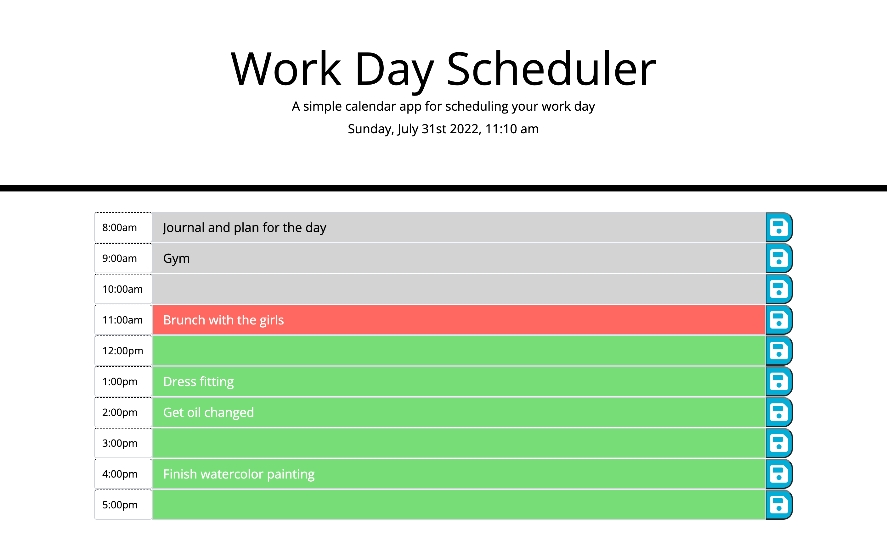

# Work Day Scheduler
Work Day Schedule is a simple, easy to use calendar application, which allows the user to create tasks for each hour of the day. When the hour has passed, the rows will be gray. Red rows represent tasks that are currently due, green items represent future tasks.

## Built With:
- HTML
- CSS
- JavaScript

## Links
- [Github Repository](https://github.com/hlnicks/work-day-scheduler)
- [GitHub Page](https://hlnicks.github.io/work-day-scheduler/)

## Screenshot

## Credits
- [Original Repo](https://github.com/coding-boot-camp/super-disco)
- ['Save' Icon](https://fontawesome.com/v5/icons/save?s=solid)
